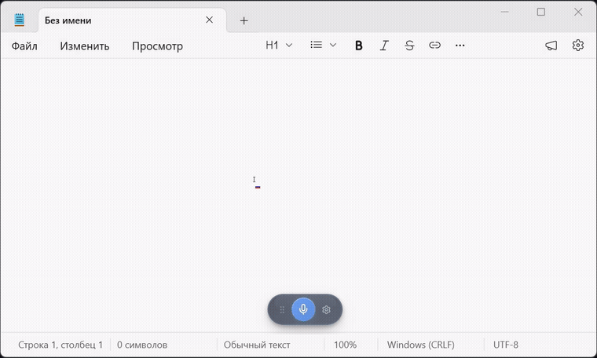
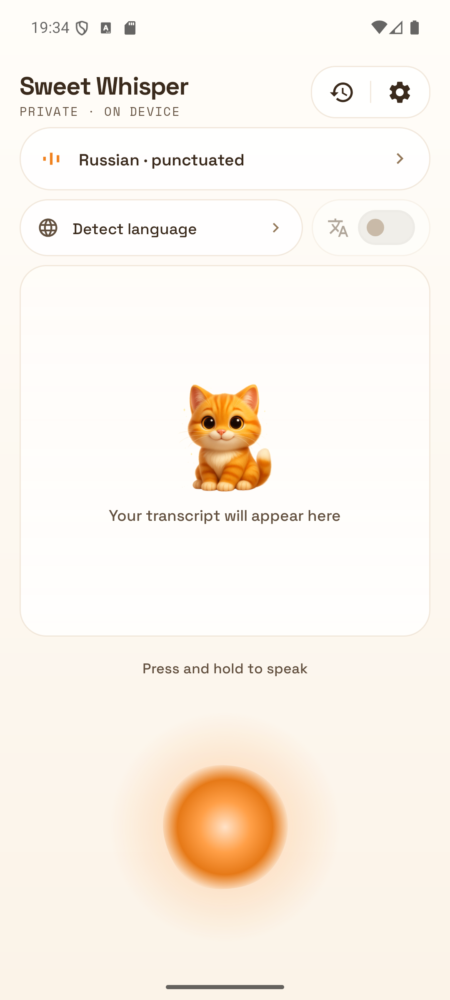
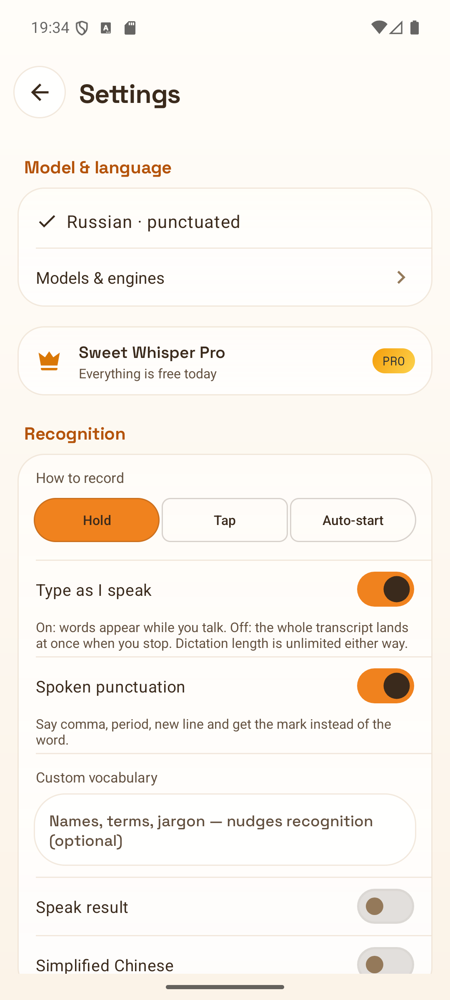

[Русский](README.md) · **English**

# SweetWhisper

**Voice typing for Windows and Android. Speech is recognized on your own device — the audio never leaves it.**

[🌐 Website](https://sweetwhisper.app/en/) · [⬇️ Download](#download) · [🤖 Android app](https://sweetwhisper.app/en/android/) · [🐛 Report a bug](../../issues/new/choose)

<!-- Badge versions are edited by hand on each release. -->

**It's out.** The Windows build and the Android app are ready to download right now — links below.

---

Hold a hotkey — speak — release. The text lands in whatever app has focus: messenger, email, IDE, browser. Same thing on the phone, except the hotkey is the microphone on your keyboard. No internet required, no subscription, no voice sent to the cloud.

## Download

| Platform | File | Size | From the site | From GitHub |
|---|---|---|---|---|
| **Windows 10/11** · installer | `SweetWhisper-Setup.exe` | 19.3 MB | [download](https://sweetwhisper.app/dl/SweetWhisper-Setup.exe) | [v0.14.4](../../releases/tag/v0.14.4) |
| **Windows 10/11** · portable | `SweetWhisper-Portable.zip` | 37.3 MB | [download](https://sweetwhisper.app/dl/SweetWhisper-Portable.zip) | [v0.14.4](../../releases/tag/v0.14.4) |
| **Android 9+** · APK | `SweetWhisper.apk` | 36.2 MB | [download](https://sweetwhisper.app/dl/SweetWhisper.apk) | [android-v3.31](../../releases/tag/android-v3.31) |

The site and Releases serve the very same file, byte for byte — take whichever is convenient. The site links always point at the newest build, while [Releases](../../releases) keep the older versions and the checksums. What changed from version to version: the [full changelog](https://sweetwhisper.app/en/changelog/).

On first launch Windows may show a SmartScreen prompt: the app is young and has not built up a "reputation" with Microsoft yet. [What that means and why it is harmless](https://sweetwhisper.app/en/#download). Android will ask once whether you trust the source you are installing from — [step by step, with pictures](https://sweetwhisper.app/en/android/).

The **free Windows version** does the whole of recognition, with no limits: every engine, every model, dictation, history. **Pro** is a one-time purchase, not a subscription; it adds live preview, text cleanup by a language model, per-app profiles and other superpowers. [What you get and what it costs](https://sweetwhisper.app/en/#pricing). **On Android, dictation from the keyboard is free, Russian included**; Pro adds the floating button, translation and the heaviest models — unlocked by the same key as the desktop.

## What it does on Windows

- 🎙️ **Dictate into any window.** Hold a key or flip a toggle — the text is inserted straight into the active app.
- 🌍 **90+ languages.** GigaAM was trained on Russian specifically; Whisper and NVIDIA Parakeet cover English and 90+ more.
- 🔒 **It all runs on your machine.** Recognition happens on your GPU or CPU (Vulkan, DirectML). The network is only there to fetch a model and check for updates.
- ⚡ **Live preview.** The text appears on screen while you are still speaking.
- 🗣️ **Voice commands.** "Kitty, undo", "Kitty, open notepad" — hands-free control.
- 🤖 **Text cleanup.** A local language model drops filler words, restores punctuation, translates — offline as well.
- 👤 **Per-app profiles.** Separate settings for your IDE, your messenger and your documents, switched automatically.
- 📜 **Dictation history.** Search across everything you have ever dictated.

## Sweet Whisper for Android

It is a voice keyboard: you dictate right where you normally type. Open a chat, tap the microphone on the keyboard, speak — the words land straight in the message. Nothing to copy, nowhere to switch.

- Dictate in any app — straight from the keyboard
- Everything runs on the phone; recordings never leave the device
- GigaAM hears Russian with commas and capitals
- The model is matched to your phone on first launch
- Searchable history, your own dictionary of terms, spoken punctuation
- Quick-settings tile, home-screen widget and system voice input
- Free, no ads, no account

[How to install the APK and enable the keyboard →](https://sweetwhisper.app/en/android/)

## What you need

**Windows**

- Windows 10 or 11, 64-bit
- A GPU is optional: Vulkan (NVIDIA, AMD, Intel) makes it faster, and without one the lighter models still work
- 2–4 GB of disk space for models — downloaded on first launch, the ones you choose

**Android**

- Android 9 or newer
- 0.2–1 GB for the model, depending on which one you pick

## Found a bug? Have an idea?

Open an [issue](../../issues/new/choose) — the template will tell you what to attach. The app has a "Copy diagnostics" button (Settings → General → "Help & Feedback"): paste its output into your report and the fix will come noticeably sooner. We answer fast — for early users, fixes ship in days rather than months.

Questions, impressions and wishes go to [Discussions](../../discussions).

## Privacy

Audio and recognized text **never leave your device**. The network is there for exactly three things: downloading a model you picked, checking for updates, and sending an error report — and the last one only when you press the button yourself. Details: [privacy policy](https://sweetwhisper.app/en/privacy/).

## License

SweetWhisper is proprietary software (© Roger, all rights reserved). This repository holds distribution materials, not the source code.

The app is built on open engines — [whisper.cpp](https://github.com/ggml-org/whisper.cpp), [ONNX Runtime](https://github.com/microsoft/onnxruntime) — and open models: Whisper © OpenAI (MIT), GigaAM © SberDevices (MIT), Parakeet © NVIDIA (CC-BY-4.0), Silero VAD. The Android app is a fork of [whisperIME](https://github.com/woheller69/whisperIME) © woheller69 (MIT). Full list in the app: Settings → About → "Open source licenses".
