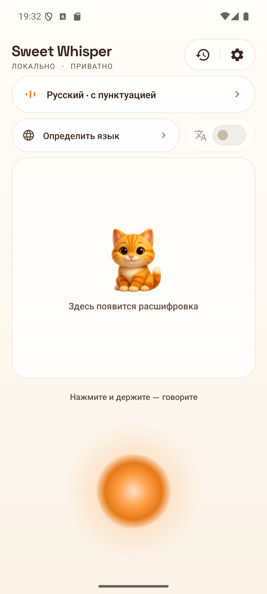
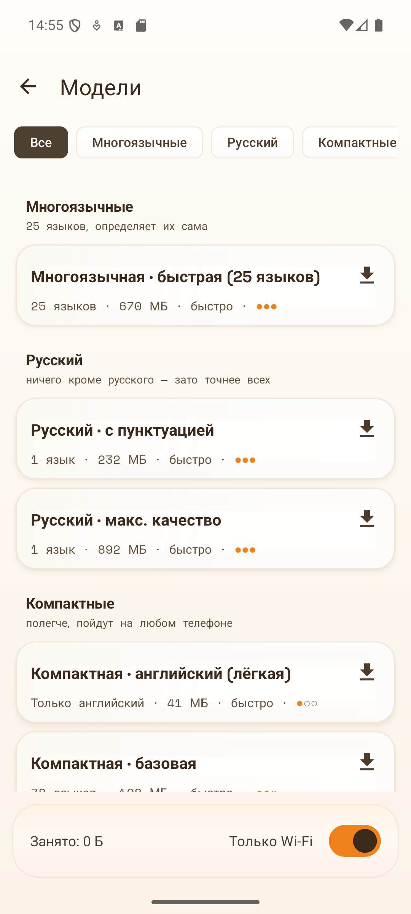
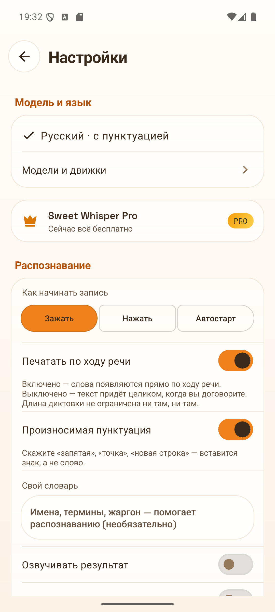

**Русский** · [English](README.en.md)

# SweetWhisper

**Голосовой ввод для Windows и Android. Речь распознаётся на самом устройстве — аудио никуда не уходит.**

[🌐 Сайт](https://sweetwhisper.app) · [⬇️ Скачать](#скачать) · [🤖 Версия для Android](https://sweetwhisper.app/android/) · [🐛 Сообщить о баге](../../issues/new/choose)

<!-- Версии в бейджах правятся руками при каждом релизе. -->

**Программа вышла.** Windows-версию и приложение для Android можно скачать прямо сейчас — ссылки ниже.

---

Зажмите горячую клавишу — говорите — отпустите. Текст появляется в том приложении, где стоит курсор: мессенджер, почта, IDE, браузер. На телефоне то же самое, только вместо горячей клавиши — микрофон на клавиатуре. Без интернета, без подписок, без отправки голоса в облако.

## Скачать

| Платформа | Файл | Размер | С сайта | С GitHub |
|---|---|---|---|---|
| **Windows 10/11** · установщик | `SweetWhisper-Setup.exe` | 18,6 МБ | [скачать](https://sweetwhisper.app/dl/SweetWhisper-Setup.exe) | [v0.11.12](../../releases/latest) |
| **Windows 10/11** · portable | `SweetWhisper-Portable.zip` | 35,7 МБ | [скачать](https://sweetwhisper.app/dl/SweetWhisper-Portable.zip) | [v0.11.12](../../releases/latest) |
| **Android 9+** · APK | `SweetWhisper.apk` | 36,2 МБ | [скачать](https://sweetwhisper.app/dl/SweetWhisper.apk) | [android-v3.29](../../releases/tag/android-v3.29) |

На сайте и в Releases лежит один и тот же файл, байт в байт, — берите откуда удобнее. Ссылки на сайте всегда ведут на свежую сборку, а в [Releases](../../releases) остаются прошлые версии и контрольные суммы. Что менялось от версии к версии — [полная история изменений](https://sweetwhisper.app/changelog/).

При первом запуске Windows может показать SmartScreen: приложение молодое и ещё не набрало «репутацию» у Microsoft. [Что это значит и почему не страшно](https://sweetwhisper.app/#download). Android один раз спросит, доверяете ли вы источнику установки — [пошагово, с картинками](https://sweetwhisper.app/android/).

**Бесплатная версия для Windows** умеет всё распознавание целиком, без ограничений: любой движок, любая модель, диктовка, история. **Pro** — разовая покупка, не подписка; добавляет живой предпросмотр, очистку текста языковой моделью, профили и другие суперспособности. [Что входит и сколько стоит](https://sweetwhisper.app/#pricing). **На Android диктовка с клавиатуры бесплатна, русский тоже**; Pro добавляет плавающую кнопку, перевод и самые тяжёлые модели — и открывается тем же ключом, что на компьютере.

## Что умеет на Windows

- 🎙️ **Диктовка в любое окно.** Зажали клавишу или включили переключателем — текст вставляется прямо в активное приложение.
- 🇷🇺 **Русский слышит по-настоящему.** GigaAM обучена именно на русском; Whisper и Parakeet держат английский и ещё 90+ языков.
- 🔒 **Всё считается у вас.** Распознавание идёт на вашей видеокарте или процессоре (Vulkan, DirectML). Сеть нужна только чтобы скачать модель и проверить обновление.
- ⚡ **Живой предпросмотр.** Текст появляется на экране, пока вы ещё говорите.
- 🗣️ **Голосовые команды.** «Котик, отмена», «Котик, открой блокнот» — управление без рук.
- 🤖 **Очистка текста.** Локальная языковая модель убирает слова-паразиты, расставляет знаки, переводит — тоже без интернета.
- 👤 **Профили под приложения.** Свои настройки для IDE, мессенджера и документов, переключаются сами.
- 📜 **История диктовок.** Поиск по всему, что вы когда-либо надиктовали.

## Sweet Whisper для Android

Это голосовая клавиатура: вы диктуете там же, где обычно пишете. Открыли чат, нажали на клавиатуре микрофон, сказали — слова падают прямо в сообщение. Ничего копировать и никуда переключаться не нужно.

- Диктовка в любом приложении — прямо с клавиатуры
- Всё считается на телефоне, записи не покидают устройство
- Русский слышит GigaAM — с запятыми и заглавными буквами
- Модель подбирается под ваш телефон на первом запуске
- История с поиском, свой словарь терминов, произносимая пунктуация
- Плитка в шторке, виджет и системный голосовой ввод
- Бесплатно, без рекламы и без аккаунта

[Как установить APK и включить клавиатуру →](https://sweetwhisper.app/android/)

## Что нужно для работы

**Windows**

- Windows 10 или 11, 64-разрядная
- Видеокарта не обязательна: с Vulkan (NVIDIA, AMD, Intel) быстрее, без неё работают модели полегче
- 2–4 ГБ на диске под модели — скачиваются при первом запуске, те, которые выберете

**Android**

- Android 9 или новее
- 0,2–1 ГБ под модель, смотря какую выберете

## Нашли ошибку? Есть идея?

Заведите [issue](../../issues/new/choose) — шаблон подскажет, что приложить. В приложении есть кнопка «Скопировать диагностику» (Настройки → Основные → «Помощь и обратная связь»): вставьте её вывод в сообщение, и починка пойдёт заметно быстрее. Отвечаем быстро — правки для первых пользователей выходят днями, а не месяцами.

Вопросы, впечатления и пожелания — в [обсуждения](../../discussions).

## Приватность

Аудио и распознанный текст **никогда не покидают ваше устройство**. Сеть нужна ровно для трёх вещей: скачать модель, которую вы выбрали, проверить обновление и отправить отчёт об ошибке — последнее только тогда, когда вы сами нажали кнопку. Подробнее — [политика приватности](https://sweetwhisper.app/privacy/).

## Лицензия

SweetWhisper — проприетарное ПО (© Roger, все права защищены). В этом репозитории лежат материалы дистрибуции, а не исходный код.

Приложение построено на открытых движках — [whisper.cpp](https://github.com/ggml-org/whisper.cpp), [ONNX Runtime](https://github.com/microsoft/onnxruntime) — и открытых моделях: Whisper © OpenAI (MIT), GigaAM © SberDevices (MIT), Parakeet © NVIDIA (CC-BY-4.0), Silero VAD. Приложение для Android — форк [whisperIME](https://github.com/woheller69/whisperIME) © woheller69 (MIT). Полный список — в приложении: Настройки → О программе → «Open Source лицензии».
